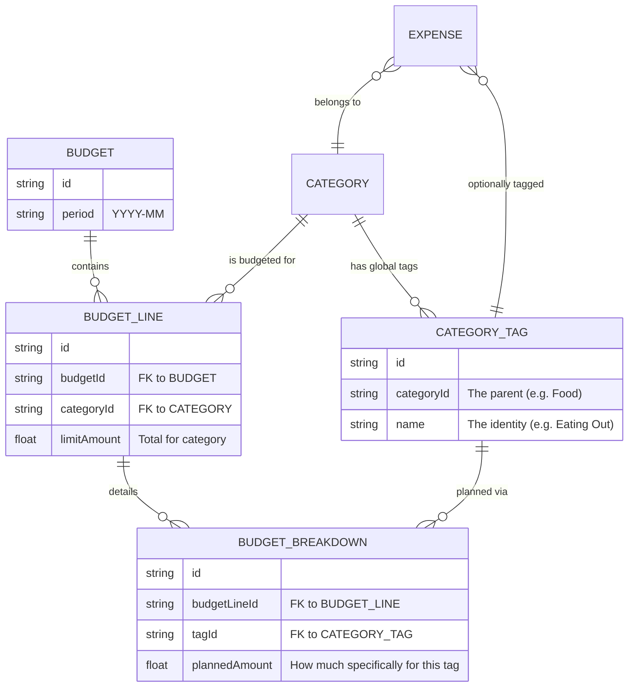

# Global Tagging Architecture

This document outlines the architectural changes implemented to support global tagging and decoupled budget planning.

## Objective

The goal was to decouple transaction "identity" (Tags) from monthly "planning" (Budget Breakdowns). This allows:
1.  **Ad-hoc Tagging**: Tagging any transaction with a category-specific label, even if it wasn't budgeted for.
2.  **Persistent Identity**: Reusing the same "Avocado" tag across multiple months for better analytics.
3.  **Flexible Planning**: Linking global tags to specific monthly budget lines when planning.

## Database Schema Diagram

## Database Schema Changes

### [NEW] `category_tags` Table
This table stores the unique identity of items within a category.
| Column | Type | Description |
| :--- | :--- | :--- |
| `id` | TEXT (UUID) | Primary Key |
| `categoryId` | TEXT | Link to the parent category |
| `name` | TEXT | The name of the tag (e.g., "Charcoal", "Eating Out") |

### [MODIFIED] `budget_breakdowns` Table
Decoupled from hardcoded strings and linked to the new tag system.
| Column | Change | Description |
| :--- | :--- | :--- |
| `itemName` | **DELETED** | Removed in favor of `tagId` |
| `tagId` | **ADDED** | Link to the persistent `category_tags` record |

### [MODIFIED] `expenses` Table
Added support for granular tagging.
| Column | Change | Description |
| :--- | :--- | :--- |
| `tagId` | **ADDED** | (Optional) Link to a `category_tags` record |

## Repository Layer Updates

### `BudgetRepository.ts`
- **`getOrCreateTag(categoryId, name)`**: The "Hub" function ensure tags are unique per category.
- **`getCategoryTags(categoryId)`**: Fetches all tags used or planned for a category.
- **`getBudgetWithBreakdowns`**: Refactored to include both planned items and spending against those tags.

### `ExpenseRepository.ts`
- **`addExpense` / `updateExpense`**: Now support persisting the `tagId`.

## UI Integration

1.  **Tag Selection**: Replaced the "Budget Allocation" step with a "Transaction Tag" step in the manual entry and detail modals.
2.  **Visual Indicators**: Tags that are part of the current month's budget are marked with a bullet (•).
3.  **Dynamic Creation**: "New Tag" option in the UI allows creating a `category_tags` entry without exiting the transaction flow.

## Data Migration

Upon the first run of this architecture, the system automatically:
1.  Creates the `category_tags` table.
2.  Iterates through existing `budget_breakdowns`.
3.  Creates a new `category_tag` for each unique `itemName`.
4.  Updates the `budget_breakdowns` to link to these new tags via `tagId`.
