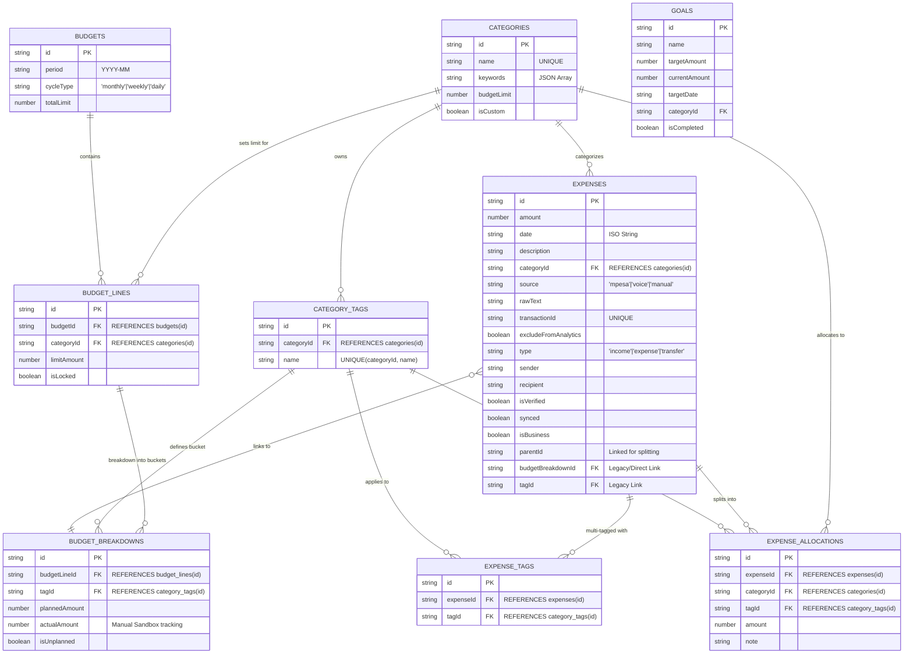

# Phase Summary Report: Advanced Budgeting & Modal Infrastructure

This report provides a comprehensive, in-depth account of the features, architectural shifts, and technical refinements implemented in this phase.

## 1. Major Feature Elaborations

### A. Global Tagging & Unified Taxonomy
We have transitioned from localized "keywords" to a **Global Tagging System**. 
- **The Feature**: Tags (e.g., "Shell", "Naivas", "Rent") are now stored in a central `category_tags` table, linked to their parent Categories.
- **Why**: This creates a single source of truth for the entire app. A tag created in the Budget view is immediately available in the Ledger (Transaction) view.
- **Implementation**: We implemented a **Normalization Engine** that stores tags in lowercase to prevent duplicates (e.g., "Rent" and "rent") but displays them in **Title Case** for a premium UI feel. We also added a **Deduplication Migration** that merges historically messy tag data into this new unified structure.

### B. The Budget "Sandbox" & Itemized Reconciliation
This phase introduced a "Sandbox" layer to the budgeting engine.
- **The Feature**: Users can now break down a broad Category budget (e.g., "Food") into specific, planned "Buckets" (tags like "Groceries", "Lunch Out"). 
- **Actuals Tracking**: We added an `actualAmount` field to budget itemizations. This allows users to manually track their progress ("Sanbox mode") while the system simultaneously calculates "Linked Totals" from live M-Pesa transactions.
- **Reconciliation Engine**: We built a logic layer that calculates the difference between **M-Pesa Ledger Totals** and **Manual Itemized Totals**. This highlights "Unaccounted/Unclaimed" spending, forcing financial discipline by showing exactly where the money went.

### C. Transaction Splitting (Allocations)
We implemented high-precision **Parent-Child Splitting**.
- **The Feature**: A single M-Pesa transaction (e.g., KES 5,000 to "Supermarket") can now be split into multiple sub-parts (Allocations) with different categories and tags.
- **The Logic**: Instead of duplicating rows (which breaks Ledger totals), we store these in a dedicated `expense_allocations` table. The main transaction remains intact, but the Analytics and Budget views now intelligently "read through" to the splits.
- **UI Interaction**: The `TransactionDetailModal` now features an "Unallocated Balance" indicator that updates in real-time as you add splits, ensuring the total always balances.

### D. Unplanned Spending Logic
Formalized the difference between "Planned" and "Impulse" spending.
- **The Feature**: Added an `isUnplanned` flag to the database and UI.
- **Utility**: In the `BudgetDetailScreen`, items are now deterministically split into two distinct tables: **Planned** and **Unplanned**. This gives users immediate visual feedback on their budget adherence without mixing "Essential" and "Impulse" rows.

---

## 2. Technical Nuances & Subtle Refinements

### The "SwipeableSheet" Architecture (Modal Overhaul)
The application moved from standard native Modals to a custom-built, gesture-sensitive `SwipeableSheet`.
- **Visibility-First Logic**: We resolved a persistent "zero-height collapse" bug. The solution was removing `flex: 1` from internal wrappers and allowing the content to naturally drive the sheet's height, capped by a rigid `maxHeight`.
- **Keyboard Dynamics**: We implemented a dynamic `maxHeight` adjustment. When the keyboard rises, the sheet shrinks to exactly `SCREEN_HEIGHT - keyboardHeight`, preventing it from overlapping the status bar.
- **Scrolling Priority**: Fixed the "Cut-off" issue where bottom items weren't visible. We implemented a standardized `paddingBottom: 150` for all scrollable list sheets, ensuring the last items clear the device bottom edge/home indicator.

### Bug Fixes & Optimizations
- **Deduplication**: Implemented `deduplicateAndTrimTags` in the repository to clean up whitespace and casing at the source.
- **Crash Fixes**: Resolved a naming collision between `loadData` and `loadDetails` in the Budget screens.
- **UI Polish**: Fixed an `opcaity` typo that made some budget rows look invisible. 
- **Precision**: Fixed the `unallocatedBalance` calculation to correctly subtract split totals from the parent transaction.
- **Consistency**: Standardized all selection UI (Categories/Tags) into a **Grid Panel** layout instead of simple lists for better thumb-reachability.

---

## 3. Validated Database ERD (Entity Relationship Diagram)

*This diagram has been cross-referenced with `Database.ts` and `Schema.ts` and represents the absolute current state of the database.*

---

## 4. Future Development Roadmap

- **Discipline Analytics**: Implement the "Locked" status logic to restrict overspending once a budget is frozen.
- **Smart Mapping**: Enhancing the `AutoClassifier` to read from the new `category_tags` table for smarter local matching.
- **Performance**: Monitor SQLite query performance on the `EXPENSE_ALLOCATIONS` joins as history grows.
- **Theme Standardization**: Move all hardcoded bottom paddings (e.g., 150px) into a centralized `theme/layout.ts` file.
