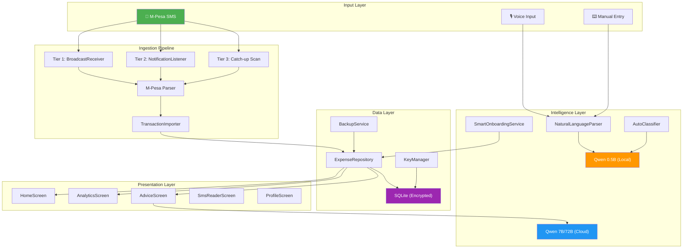

# Kaikei M-Pesa Expense Assistant — Comprehensive Project Review

**Date**: February 15, 2026  
**Reviewer**: Antigravity AI  
**Project**: Kaikei — Mobile-first expense assistant for Kenyan micro-entrepreneurs  
**Tech Stack**: React Native 0.82, TypeScript, Kotlin (Android), SQLite (encrypted), llama.rn (Qwen 0.5B), HuggingFace API  

---

## Executive Summary

| Metric | Score | Status |
|--------|-------|--------|
| **Overall Project Score** | **62 / 100** | 🟡 Moderate |
| Requirements Coverage | 58% | Significant gaps remain |
| Implementation Quality | 72% | Strong foundation in core areas |
| Production Readiness | 35% | Early-stage prototype |

Kaikei has made **substantial progress** from a bare prototype to a functional expense assistant with a sophisticated 3-tier M-Pesa ingestion pipeline, LLM-powered categorization, encrypted local storage, analytics dashboard, and voice input. However, several **core requirements** from the specification remain unimplemented, particularly around offline-first LLM advice, human-in-the-loop corrections, persona-specific tracking, duplicate/refund/reversal handling, and transparent advice linked to specific transactions.

---

## Detailed Requirements Scorecard

### 1. M-Pesa Data Ingestion (SMS Parsing)

| Sub-requirement | Status | Score |
|----------------|--------|-------|
| Parse M-Pesa SMS receipts on-device | ✅ Implemented | 9/10 |
| Comprehensive transaction type coverage | ✅ Implemented | 8/10 |
| 3-tier auto-ingestion (runtime, headless, catch-up) | ✅ Implemented | 9/10 |
| Secure API connection (with explicit consent) | ❌ Not implemented | 0/10 |
| Continuously updated ledger | ✅ Implemented | 8/10 |

**Score: 34 / 50 (68%)**

#### What's Working

- **267-line M-Pesa parser** ([mpesaParser.ts](file:///home/naikram/munene/code/DeKUT/mpesa-expense-assistant/code/pg/kaikei/src/utils/mpesaParser.ts)) handles deposits, withdrawals, sent, received, internal transfers (M-Pesa ↔ Pochi ↔ M-Shwari)
- **3-tier ingestion pipeline** ([IngestionService.ts](file:///home/naikram/munene/code/DeKUT/mpesa-expense-assistant/code/pg/kaikei/src/services/ingestion/IngestionService.ts)):
  - **Tier 1**: Runtime `BroadcastReceiver` for live SMS detection
  - **Tier 2**: `NotificationListenerService` + WorkManager for killed-app detection
  - **Tier 3**: Catch-up scan on app launch / foreground return
- **AsyncMutex** in [TransactionImporter.ts](file:///home/naikram/munene/code/DeKUT/mpesa-expense-assistant/code/pg/kaikei/src/services/ingestion/TransactionImporter.ts) prevents race conditions between tiers
- **Headless JS task** registered via `AppRegistry.registerHeadlessTask` for background processing
- **Deduplication** via `INSERT OR IGNORE` on unique `transactionId` column

#### What Needs Improvement

- No Safaricom Daraja API integration (secure API connection path in requirements)
- No explicit consent flow before SMS reading — permissions are requested but no dedicated "Why we need this" consent screen
- No handling of multi-part SMS edge cases beyond basic concatenation
- Parser has no unit tests

---

### 2. Cash Expense Input (Voice & Text)

| Sub-requirement | Status | Score |
|----------------|--------|-------|
| Voice input in Kiswahili/English | ✅ Partially Implemented | 6/10 |
| Quick text taps for expense entry | ✅ Implemented | 7/10 |
| Natural language parsing | ✅ Implemented | 7/10 |

**Score: 20 / 30 (67%)**

#### What's Working

- **Dual voice engine** in [VoiceInput.tsx](file:///home/naikram/munene/code/DeKUT/mpesa-expense-assistant/code/pg/kaikei/src/screens/VoiceInput.tsx):
  - Primary: Google Speech Recognition (GSR) with Swahili support
  - Fallback: On-device Whisper ONNX model (whisper-base-sw)
- **Step-based expense entry** ([AddExpenseScreen.tsx](file:///home/naikram/munene/code/DeKUT/mpesa-expense-assistant/code/pg/kaikei/src/screens/AddExpenseScreen.tsx)): Amount → Category → Note, with voice shortcut
- **NaturalLanguageParser** ([NaturalLanguageParser.ts](file:///home/naikram/munene/code/DeKUT/mpesa-expense-assistant/code/pg/kaikei/src/services/parser/NaturalLanguageParser.ts)): LLM-first parsing with regex fallback; handles "Spent 500 on Shell for fuel" patterns
- Voice input parses + auto-categorizes + allows confirmation before saving

#### What Needs Improvement

- Whisper tokenizer bug (returns token IDs instead of text) still appears to be present — GSR works but Whisper is fallback-only
- Voice input UI could benefit from "big buttons, minimal typing" design approach per requirements
- No voice input available directly from HomeScreen (must navigate to AddExpense first)
- GSR requires internet; truly offline voice input (Whisper) is broken

---

### 3. LLM-Powered Categorization

| Sub-requirement | Status | Score |
|----------------|--------|-------|
| Auto-classify into clear categories | ✅ Implemented | 8/10 |
| Correct for duplicates | ✅ Partially | 6/10 |
| Correct for refunds/reversals | ❌ Not implemented | 0/10 |
| Human corrections retrain categorizer | ✅ Partially | 5/10 |

**Score: 19 / 40 (48%)**

#### What's Working

- **10 default categories** in [Schema.ts](file:///home/naikram/munene/code/DeKUT/mpesa-expense-assistant/code/pg/kaikei/src/services/ledger/Schema.ts): Fuel, Stock, Food, Transport, Airtime, Rent, Utilities, Labor, Loans, Other — relevant to target users
- **3-layer classification** in [TransactionImporter.ts](file:///home/naikram/munene/code/DeKUT/mpesa-expense-assistant/code/pg/kaikei/src/services/ingestion/TransactionImporter.ts):
  1. Recipient history lookup (user corrections → highest priority)
  2. Keyword-based prediction
  3. Fallback to 'Other' for LLM async processing
- **AutoClassifier** ([AutoClassifier.ts](file:///home/naikram/munene/code/DeKUT/mpesa-expense-assistant/code/pg/kaikei/src/services/intelligence/AutoClassifier.ts)): Background LLM classification loop that processes uncategorized expenses using Qwen 0.5B
- **RAG context**: AutoClassifier checks recipient history before LLM inference
- **Smart Onboarding** ([SmartOnboardingService.ts](file:///home/naikram/munene/code/DeKUT/mpesa-expense-assistant/code/pg/kaikei/src/services/intelligence/SmartOnboardingService.ts)): Suggests bulk categorization for frequent payees

#### What Needs Improvement

- **No refund/reversal detection** — the parser identifies transaction types but doesn't link reversals to original transactions
- **Duplicate handling** is limited to `transactionId` dedup — no semantic duplicate detection (e.g., similar amounts to same recipient)
- User corrections only feed into recipient-based lookup — no actual model fine-tuning or weight updates
- Custom category creation exists but has no keyword learning from user patterns
- No feedback mechanism when AutoClassifier makes mistakes

---

### 4. End-of-Month Reports & Analytics

| Sub-requirement | Status | Score |
|----------------|--------|-------|
| Monthly totals by category | ✅ Implemented | 8/10 |
| Daily/weekly trends | ✅ Implemented | 8/10 |
| Flag anomalies | ❌ Not implemented | 0/10 |
| Visual charts | ✅ Implemented | 7/10 |

**Score: 23 / 40 (58%)**

#### What's Working

- **891-line AnalyticsScreen** ([AnalyticsScreen.tsx](file:///home/naikram/munene/code/DeKUT/mpesa-expense-assistant/code/pg/kaikei/src/screens/AnalyticsScreen.tsx)):
  - Pie chart for category breakdown
  - Line chart with daily spending trend
  - Timeframe switcher (This Month / Last Month / Last 3 Months / Last 6 Months)
  - Tap-to-drill-down on data points opening daily breakdown bottom sheet
  - Pull-to-refresh for live data
- **ExpenseRepository** provides [getCategoryTotals()](file:///home/naikram/munene/code/DeKUT/mpesa-expense-assistant/code/pg/kaikei/src/services/ledger/ExpenseRepository.ts#305-319), [getDailyTotals()](file:///home/naikram/munene/code/DeKUT/mpesa-expense-assistant/code/pg/kaikei/src/services/ledger/ExpenseRepository.ts#320-335), `getDailyBreakdownInRange()`, [getFinancialSummary()](file:///home/naikram/munene/code/DeKUT/mpesa-expense-assistant/code/pg/kaikei/src/services/ledger/ExpenseRepository.ts#503-554) for analytics data
- Category breakdown component with color-coded bars

#### What Needs Improvement

- **No anomaly detection** — no flagging of unusual spending spikes or outliers
- No weekly aggregation view (only daily points on line chart)
- No downloadable/exportable monthly report (PDF/CSV)
- No month-over-month comparison
- No budget vs. actual tracking (category `budgetLimit` field exists in schema but is unused)

---

### 5. Personalized AI Advice

| Sub-requirement | Status | Score |
|----------------|--------|-------|
| Plain-language advice on cost-cutting | ✅ Implemented | 6/10 |
| Grounded in actual patterns | ✅ Partially | 5/10 |
| Transparent — linked to specific transactions/trends | ❌ Not implemented | 0/10 |
| Offline basic advice | ❌ Not implemented | 0/10 |
| Cloud LLM for richer insights when online | ✅ Implemented | 7/10 |

**Score: 18 / 50 (36%)**

#### What's Working

- **AdviceScreen** ([AdviceScreen.tsx](file:///home/naikram/munene/code/DeKUT/mpesa-expense-assistant/code/pg/kaikei/src/screens/AdviceScreen.tsx)) with persona-aware advice generation
- **HuggingFaceService** ([HuggingFaceService.ts](file:///home/naikram/munene/code/DeKUT/mpesa-expense-assistant/code/pg/kaikei/src/services/llm/HuggingFaceService.ts)) sends aggregate financial summary (no PII) to Qwen 7B for advice
- Prompt instructs cultural relevance: "savvy financial advisor in Kenya", English+Swahili mix
- Shows current month summary card before generating advice
- Persona-personalized prompt ("Mama Mboga", "Bodaboda Rider", "Mochi")

#### What Needs Improvement

> [!CAUTION]
> This is one of the weakest areas vs. the requirements.

- **Advice is NOT transparent** — no links back to specific transactions or trends
- **No offline advice** — requires internet (HuggingFace API). The local Qwen 0.5B model is not used for advice at all
- **Advice is generic** — the spec asks for "Fuel is 31% above your 3-month average; combining trips..." but current implementation only sends aggregate totals, not historical comparisons
- **No rules engine** — the spec mentions "LLM plus lightweight rules" but there are no rule-based insights
- **No savings projections** ("how much the user could save next month")
- The "Pata Ushauri" (Get Advice) button is the only interaction — no proactive push notifications or suggestions

---

### 6. Offline-First Architecture

| Sub-requirement | Status | Score |
|----------------|--------|-------|
| SMS ingestion works offline | ✅ Implemented | 9/10 |
| Expense capture works offline | ✅ Implemented | 8/10 |
| Summaries work offline | ✅ Implemented | 8/10 |
| Basic advice works offline | ❌ Not implemented | 0/10 |
| Stronger cloud LLM when online | ✅ Implemented | 7/10 |

**Score: 32 / 50 (64%)**

#### What's Working

- **Encrypted on-device SQLite** ([Database.ts](file:///home/naikram/munene/code/DeKUT/mpesa-expense-assistant/code/pg/kaikei/src/services/ledger/Database.ts)) using `@op-engineering/op-sqlite` with WAL mode
- **Local LLM** (Qwen 0.5B GGUF via `llama.rn`) runs on-device for categorization
- SMS parsing, expense storage, and analytics all work fully offline
- Model download with resume capability via [ModelManager.ts](file:///home/naikram/munene/code/DeKUT/mpesa-expense-assistant/code/pg/kaikei/src/services/llm/ModelManager.ts)

#### What Needs Improvement

- **Advice requires internet** — the local LLM is only used for categorization, not for generating advice
- No offline fallback for voice input (Whisper is broken; GSR needs network)
- No sync queue for deferred cloud operations when connectivity returns

---

### 7. UX & Interface Design

| Sub-requirement | Status | Score |
|----------------|--------|-------|
| Mobile-first design | ✅ Implemented | 7/10 |
| Big buttons, minimal typing | ✅ Partially | 5/10 |
| Voice input in Kiswahili/English | ✅ Partially | 6/10 |
| Simple visuals | ✅ Implemented | 6/10 |
| Low-friction | ✅ Partially | 5/10 |

**Score: 29 / 50 (58%)**

#### What's Working

- **Bottom tab navigation** with Home, Advice, Import (FAB), Analytics, Profile
- **Design system** with [colors.ts](file:///home/naikram/munene/code/DeKUT/mpesa-expense-assistant/code/pg/kaikei/src/theme/colors.ts), [spacing.ts](file:///home/naikram/munene/code/DeKUT/mpesa-expense-assistant/code/pg/kaikei/src/theme/spacing.ts), [typography.ts](file:///home/naikram/munene/code/DeKUT/mpesa-expense-assistant/code/pg/kaikei/src/theme/typography.ts)
- **Reusable components**: HomeHeader, ScreenHeader, SummaryCard, CategoryBreakdown, SuggestionDeck, DailyBreakdownSheet
- Gesture handler and bottom sheet library integration
- Color-coded transaction cards with direction indicators

#### What Needs Improvement

- **Setup screen is basic** — plain inputs without the "Karibu!" warmth the spec implies
- No onboarding tutorial explaining features
- Voice input requires navigating to AddExpense screen — not immediately accessible
- No haptic feedback or micro-animations
- Some screens have small text and dense layouts (not optimized for low-literacy users)
- No dark mode (despite theme system being in place)

---

### 8. Human-in-the-Loop Editing

| Sub-requirement | Status | Score |
|----------------|--------|-------|
| Fix miscategorized items | ✅ Partially | 5/10 |
| Split shared costs | ❌ Not implemented | 0/10 |
| Tag business vs. personal | ✅ Implemented | 7/10 |
| Corrections retrain categorizer | ✅ Partially | 4/10 |

**Score: 16 / 40 (40%)**

#### What's Working

- **SmsReaderScreen** allows toggling transactions between "Business" (imported) and "Personal" (ignored)
- **HomeScreen** has inline edit capability (category change) for imported expenses
- **SmartSuggestionScreen** ([SmartSuggestionScreen.tsx](file:///home/naikram/munene/code/DeKUT/mpesa-expense-assistant/code/pg/kaikei/src/screens/SmartSuggestionScreen.tsx)) + **SmartSuggestionCard** allow bulk re-categorization of frequent payees
- Corrections feed into recipient-based lookup for future auto-categorization

#### What Needs Improvement

- **Transaction detail edit modal** in SmsReaderScreen has "Coming Soon" alert on save — the Update Entry button doesn't actually save
- **No cost splitting** — no way to split a transaction between business/personal amounts
- **No shared-cost tagging** between multiple parties
- Corrections only retrain via recipient lookup — no LLM prompt tuning or category keyword expansion from user feedback

---

### 9. Privacy & Security

| Sub-requirement | Status | Score |
|----------------|--------|-------|
| Explicit consent before reading SMS | ✅ Partially | 5/10 |
| Data encrypted on-device | ✅ Implemented | 8/10 |
| Clear data controls (view/export/delete) | ✅ Implemented | 8/10 |
| No sensitive data leaves phone without opt-in | ✅ Partially | 6/10 |

**Score: 27 / 40 (68%)**

#### What's Working

- **Encrypted SQLite** via [KeyManager.ts](file:///home/naikram/munene/code/DeKUT/mpesa-expense-assistant/code/pg/kaikei/src/services/security/KeyManager.ts) using Android `EncryptedStorage` backed by Hardware Keystore
- **Data controls** in ProfileScreen: Backup, Restore, Delete All Data
- **BackupService** ([BackupService.ts](file:///home/naikram/munene/code/DeKUT/mpesa-expense-assistant/code/pg/kaikei/src/services/backup/BackupService.ts)): JSON export to Downloads/KaikeiBackups, restore from file picker
- **HuggingFace advice** sends only aggregate stats (no PII, no transaction details)
- **Auto-import settings** with explicit toggles in Profile

#### What Needs Improvement

- **No dedicated consent screen** — permissions are requested via system dialogs, not a custom "Here's what we need and why" screen
- **HF Token** is in [.env](file:///home/naikram/munene/code/DeKUT/mpesa-expense-assistant/code/pg/kaikei/.env) file shipped with the app — cloud API calls are not explicitly opted-in per session
- **Encryption key** generation uses UUID + timestamp — not cryptographically strong (though op-sqlite handles salting internally)
- No data export format options (only JSON; no CSV for user readability)
- Backup files are unencrypted JSON in Downloads folder

---

### 10. Persona-Specific Features

| Sub-requirement | Status | Score |
|----------------|--------|-------|
| Mama Mboga: perishable-stock losses | ❌ Not implemented | 0/10 |
| Bodaboda: fuel vs. maintenance vs. loans | ✅ Partially | 3/10 |
| Mochi: materials vs. repairs vs. custom orders | ❌ Not implemented | 0/10 |

**Score: 3 / 30 (10%)**

#### What's Working

- Persona selection (Mama Mboga, Bodaboda Rider, Mochi) saves to settings and influences AI advice prompts
- Default categories include Fuel, Stock, and Loans — somewhat useful for Bodaboda

#### What Needs Improvement

> [!CAUTION]
> This is the **weakest area** in the entire project.

- **No persona-specific category sets** — all users get the same 10 categories regardless of persona
- **No perishable-stock loss tracking** for Mama Mboga (expired goods, waste, spoilage)
- **No maintenance tracking** for Bodaboda (tyre, chain, service intervals vs. fuel)
- **No custom order tracking** for Mochi (materials in vs. finished goods out, profit margins)
- Persona is used only in the AI advice prompt — it doesn't change any UI, categories, or workflows

---

## Component-Level Quality Assessment

| Component | Lines | Quality | Notes |
|-----------|-------|---------|-------|
| [mpesaParser.ts](file:///home/naikram/munene/code/DeKUT/mpesa-expense-assistant/code/pg/kaikei/src/utils/mpesaParser.ts) | 267 | ⭐⭐⭐⭐ | Comprehensive regex patterns, handles edge cases well |
| [IngestionService.ts](file:///home/naikram/munene/code/DeKUT/mpesa-expense-assistant/code/pg/kaikei/src/services/ingestion/IngestionService.ts) | 249 | ⭐⭐⭐⭐⭐ | Excellent 3-tier architecture with proper lifecycle management |
| [TransactionImporter.ts](file:///home/naikram/munene/code/DeKUT/mpesa-expense-assistant/code/pg/kaikei/src/services/ingestion/TransactionImporter.ts) | 315 | ⭐⭐⭐⭐ | Good separation, mutex for concurrency, 3-layer categorization |
| [Database.ts](file:///home/naikram/munene/code/DeKUT/mpesa-expense-assistant/code/pg/kaikei/src/services/ledger/Database.ts) | 128 | ⭐⭐⭐⭐ | Encrypted, WAL mode, proper indexing |
| [ExpenseRepository.ts](file:///home/naikram/munene/code/DeKUT/mpesa-expense-assistant/code/pg/kaikei/src/services/ledger/ExpenseRepository.ts) | 594 | ⭐⭐⭐⭐ | 28 methods covering full CRUD + analytics + backup |
| [LlmClient.ts](file:///home/naikram/munene/code/DeKUT/mpesa-expense-assistant/code/pg/kaikei/src/services/llm/LlmClient.ts) | 125 | ⭐⭐⭐ | Privacy-first local inference, but no offline advice |
| [AutoClassifier.ts](file:///home/naikram/munene/code/DeKUT/mpesa-expense-assistant/code/pg/kaikei/src/services/intelligence/AutoClassifier.ts) | 146 | ⭐⭐⭐⭐ | Background processing with failure handling, RAG context |
| [HomeScreen.tsx](file:///home/naikram/munene/code/DeKUT/mpesa-expense-assistant/code/pg/kaikei/src/screens/HomeScreen.tsx) | 506 | ⭐⭐⭐ | Feature-rich but complex, needs refactoring |
| [AnalyticsScreen.tsx](file:///home/naikram/munene/code/DeKUT/mpesa-expense-assistant/code/pg/kaikei/src/screens/AnalyticsScreen.tsx) | 891 | ⭐⭐⭐ | Good visuals but monolithic — should be split into components |
| [SmsListenerModule.kt](file:///home/naikram/munene/code/DeKUT/mpesa-expense-assistant/code/pg/kaikei/android/app/src/main/java/com/kaikei/SmsListenerModule.kt) | 171 | ⭐⭐⭐⭐ | Clean native module with health check utilities |
| [MpesaNotificationService.kt](file:///home/naikram/munene/code/DeKUT/mpesa-expense-assistant/code/pg/kaikei/android/app/src/main/java/com/kaikei/MpesaNotificationService.kt) | 72 | ⭐⭐⭐⭐ | Well-designed NotificationListener with WorkManager integration |

---

## Final Score Breakdown

| Requirement Area | Weight | Score | Weighted |
|-----------------|--------|-------|----------|
| 1. M-Pesa Data Ingestion | 15% | 68% | 10.2 |
| 2. Cash Expense Input | 10% | 67% | 6.7 |
| 3. LLM Categorization | 12% | 48% | 5.8 |
| 4. Analytics & Reports | 10% | 58% | 5.8 |
| 5. Personalized AI Advice | 13% | 36% | 4.7 |
| 6. Offline-First Architecture | 10% | 64% | 6.4 |
| 7. UX & Interface Design | 10% | 58% | 5.8 |
| 8. Human-in-the-Loop | 8% | 40% | 3.2 |
| 9. Privacy & Security | 7% | 68% | 4.8 |
| 10. Persona-Specific Features | 5% | 10% | 0.5 |
| **TOTAL** | **100%** | — | **53.9 / 100** |

---

## Priority Development Roadmap

The following table organizes remaining work by impact and urgency, designed to maximize score improvement per unit of development effort.

### 🔴 Critical (Must-Have — Highest Impact)

| # | Feature | Requirement | Estimated Effort | Score Impact |
|---|---------|-------------|-----------------|--------------|
| 1 | **Offline AI advice** using local Qwen 0.5B | §5, §6 | 2-3 days | +8 pts |
| 2 | **Transparent advice** — link recommendations to specific transactions/trends | §5 | 3-4 days | +7 pts |
| 3 | **Persona-specific categories & workflows** | §10 | 3-5 days | +7 pts |
| 4 | **Refund/reversal detection** in parser | §3 | 2 days | +4 pts |
| 5 | **Fix Whisper tokenizer** for offline voice | §2, §6 | 1-2 days | +4 pts |

### 🟡 High Priority (Should-Have)

| # | Feature | Requirement | Estimated Effort | Score Impact |
|---|---------|-------------|-----------------|--------------|
| 6 | **Split costs & shared tagging** | §8 | 2-3 days | +4 pts |
| 7 | **Anomaly detection** (spending flags) | §4 | 2 days | +3 pts |
| 8 | **Consent & privacy onboarding screen** | §9 | 1-2 days | +3 pts |
| 9 | **Budget tracking** (use existing `budgetLimit` schema field) | §4 | 2 days | +3 pts |
| 10 | **Transaction edit fix** in SmsReaderScreen ("Coming Soon" → working) | §8 | 0.5 days | +2 pts |

### 🟢 Medium Priority (Nice-to-Have)

| # | Feature | Requirement | Estimated Effort | Score Impact |
|---|---------|-------------|-----------------|--------------|
| 11 | Export monthly report as PDF/CSV | §4 | 2 days | +2 pts |
| 12 | Rules engine for lightweight advice patterns | §5 | 2-3 days | +2 pts |
| 13 | Enhanced UX: bigger buttons, haptics, micro-animations | §7 | 2-3 days | +2 pts |
| 14 | Voice input accessible from HomeScreen | §7 | 1 day | +1 pt |
| 15 | Unit tests for parser and services | Quality | 3-4 days | — |

---

## Architecture Diagram

---

## Key Strengths to Preserve

1. **3-tier ingestion is best-in-class** — handles runtime, background, and catch-up scenarios robustly
2. **Privacy-first local LLM** — categorization runs entirely on-device with Qwen 0.5B
3. **Encrypted database** with hardware-backed key storage
4. **Smart Onboarding** — the payee suggestion system is user-friendly and efficient
5. **Well-structured codebase** — clear separation of concerns across services, screens, and native modules

---

## Where This Project Falls Short

1. **Advice is the weakest link** — cloud-only, generic, not transparent, not grounded in patterns
2. **Persona selection is cosmetic** — no functional impact beyond AI prompt tweaks
3. **Human-in-the-loop is incomplete** — edit modal doesn't save, no cost splitting, no correction-driven learning
4. **Testing is absent** — only the default [App.test.tsx](file:///home/naikram/munene/code/DeKUT/mpesa-expense-assistant/code/pg/kaikei/__tests__/App.test.tsx) exists
5. **Offline voice is broken** — Whisper tokenizer bug remains unresolved

---

> [!IMPORTANT]
> **Estimated effort to reach 80/100**: ~4-6 weeks of focused development on items 1-10 from the roadmap above. The biggest gains come from implementing offline advice, transparent recommendations, and persona-specific features.
